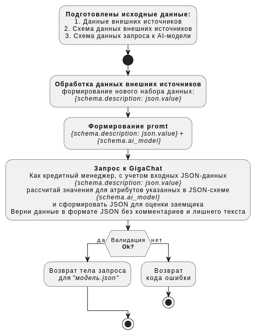

# Создание DATA-API
## Аннотация

В рамках хакатона мы провели исследование, посвященное возможностям стандартной модели искусственного интеллекта (ИИ) в подготовке данных для специализированных AI-моделей. Наша цель заключалась в разработке решения, которое принимает на вход контрактные наборы данных и формирует запросы для AI-моделей в соответствии с заданной схемой данных.

## Цели и задачи

- Исследование возможностей стандартной модели ИИ: Мы проанализировали, насколько эффективно стандартная модель может обрабатывать и подготавливать данные для специализированных моделей.
- Разработка решения: Создание инструмента, который автоматизирует процесс подготовки данных, включая формирование запросов на основе входных данных.
- Проверка гипотезы: Формулировка гипотезы о том, что специализированные модели могут значительно улучшить процесс обработки данных.

## Алгоритм решения - `Data-API pipeline`

Схема 1. workflow процесса подготовки данных

**Описание алгоритма**

**Предусловие**
1. Получены Данные(ответы) от внешних систем согласно регламента;
2. Определены Схемы данных внешних источников;
3. Определана Схема данных контракта для запроса к AI-модели.

**Основной сценарий**
1. Система получает "Данные внешних источников", "Схемы данных внешних источников", "Схему данных контракта для AI-модели";
2. Система обрабатывает Данные внешних источников и меняет наименование ключа в атрибуте на соответствующее значение description из Схемы данных внешнего источника и формирует новый набор данных;
3. Система формирует promt для GigaChat и соединяет новый набор данных и Схему данных котракта AI-модели;
4. Система выполняет запрос к GigaChat, получает ответ и формирует Payload запроса для AI-модели: сохраняет его в файл в формате JSON.

**Постусловие**
1. Система получает подтверждение выполненного задания.

## Подход и методология

- Сбор данных: Мы использовали контрактные наборы данных, которые были выбраны за их релевантность и репрезентативность для поставленной задачи
- Формирование запросов: Стандартная модель ИИ была использована при генерации запросов согласно предоставленной схеме данных. Это включало в себя настройку параметров для корректной работы с возрастной конвертацией
- Тестирование и валидация: Мы провели испытания разработанного решения, чтобы убедиться в его способности правильно выполнять возрастную конвертацию и формировать запросы

## Результаты
Результаты испытаний показали, что стандартная модель ИИ успешно формирует запросы в соответствии с 
заданной схемой и корректно выполняет возрастную конвертацию, скорость обработки входных данных не превысила 8 сек. При этом более сложные варианты обработки - определение уровня долговой нагрузки, показателей банкроства требует дообучения стандартной модели. 
Это подтверждает нашу гипотезу о том, что специализированные модели могут значительно улучшить процесс 
подготовки данных для дальнейшей обработки.

## Выводы
На основе проведенного исследования можно сделать вывод о том, что использование стандартных моделей ИИ для подготовки данных открывает новые возможности для создания специализированных AI-моделей. Это может привести к более эффективным решениям в различных областях применения ИИ.

## Перспективы
Развитие задачи подготовки данных может включать следующие шаги:

- Разработка более сложных алгоритмов для улучшения точности обработки.
- Исследование возможности интеграции нашего решения с другими системами и платформами.
- Проведение дополнительных тестов на других наборах данных для оценки универсальности разработанного инструмента.

Таким образом, наш проект не только подтвердил изначальные гипотезы, но и открыл новые горизонты для дальнейших исследований и разработок в области искусственного интеллекта.