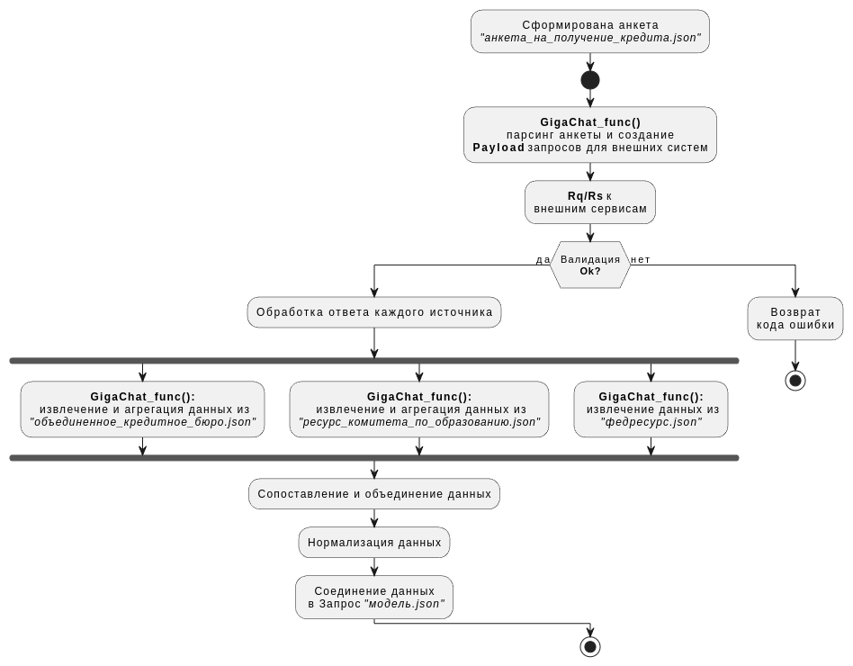

# Создание DATA-API
## Аннотация

Необходимо создать инструмент, который автоматизирует процедуру заполнения контракта AI-модели/стратегии на стороне сервиса, осуществляющего вызов, с учетом:

* Модели данных от источников, которые опрашивает сервис
* Модель данных на вход стратегии/модели
* Правила преобразования данных для подачи на стратегию/модель, например: `дата рождения в возраст`, `адрес в код региона`
* Язык программирования, для которого надо сгенерировать класс вызова модели (Java, Kotlin, Groovy, Go).

Задача открытая, нет ограничений для участников в выборе решения. На выходе должен получиться инструмент, который позволит:
решать интеграционные задачи силами “гражданских” разработчиков (системный аналитик, Риск-технолог и так далее);
упростить производственный процесс для задач добавления новых источников данных на модели, изменения контрактов существующих.
Будет плюсом, если будет предусмотрен интеллектуальный режим отладки.

## Алгоритм решения - `Data-API pipeline`

**Описание алгоритма**

Предусловие
1. Источники данных определены;
2. Форматы ответов от источников данных описаны с помощью технологии `Schema.json`.

Основной сценарий
1. Система формирует идентификатор задания и выполняет запросы  к источникам данных, получает ответы и связывает ответы с помощью Идентификатора;
3. Система валидирует ответы от источников данных с помощью `Json Schema`;
4. Система направляет пакеты с ответами в `data-api pipeline`;
5. `Data-API pipeline` выполняет обработку пакетов: парсит и при необходимости использует `Giga-Chat` для обработки;
6. Система выполняет сопоставление и объединение данных;
7. Система выполняет нормализацию данных;
8. Система формирует пакет, сохраняет в формате `json` и отправляет его потребителю.

Постусловие
Система получает подтверждение выполненного задания.

https://github.com/dk-miptedu/datacooker-pipeline/blob/main/assets/img/data-api-fabrica.png
https://github.com/dk-miptedu/datacooker-pipeline/raw/main/assets/img/imdata-api-fabrica.png

